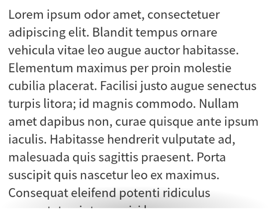

# React Scroll Shadow Pro

Show shadow for hidden content in scrollable area.



[Live Demo](https://guoyunhe.github.io/react-scroll-shadow-pro/)

```bash
npm install --save react-scroll-shadow-pro
```

```jsx device="mobile"
import { ScrollShadow } from 'react-scroll-shadow-pro';
import { LoremIpsum } from 'react-lorem-ipsum';

function App() {
  return (
    <ScrollShadow style={{ maxHeight: 300 }}>
      <div style={{ padding: 10 }}>
        <LoremIpsum p={10} />
      </div>
    </ScrollShadow>
  );
}
```
